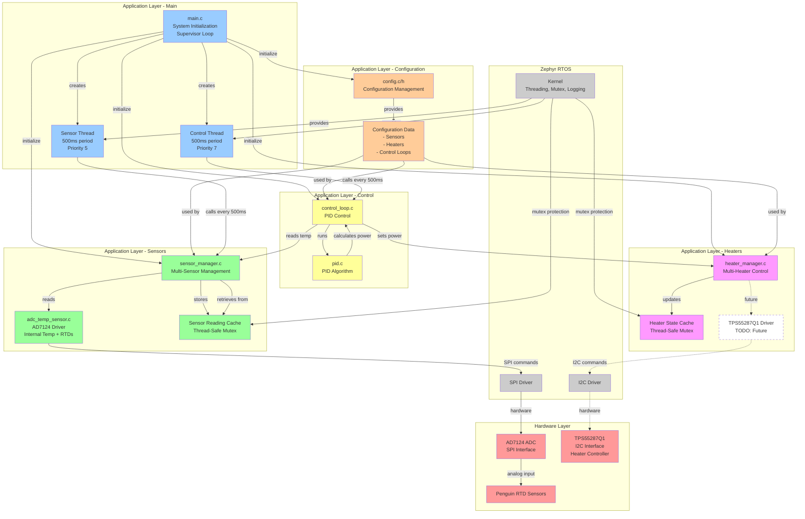
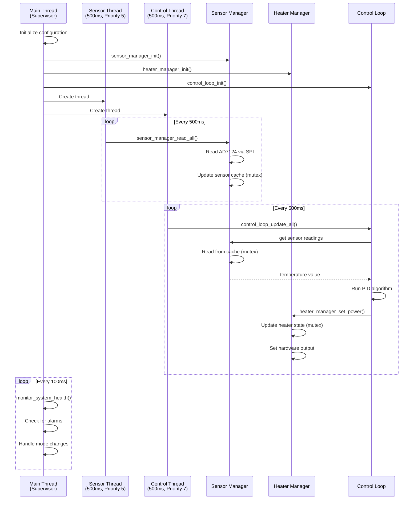
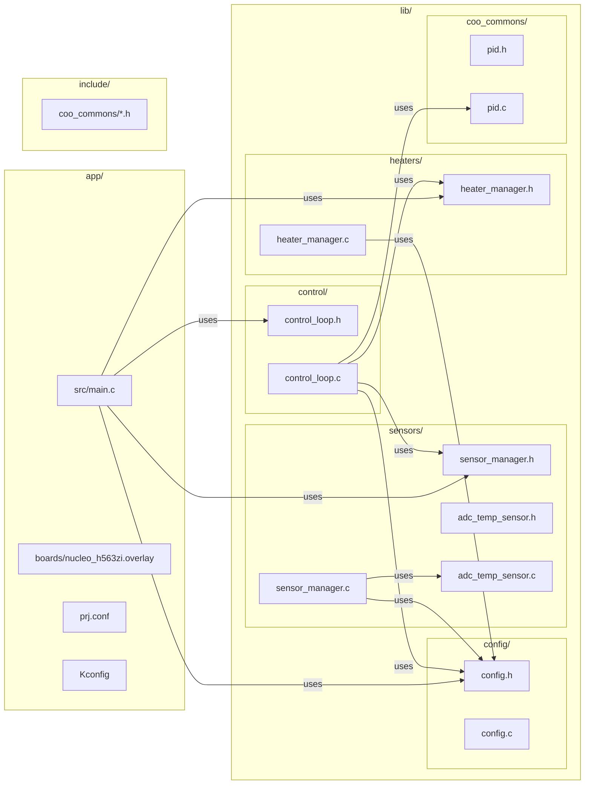
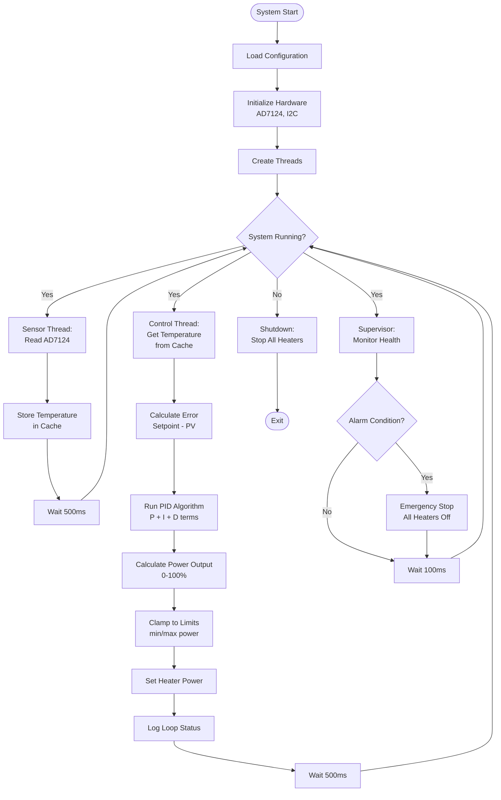
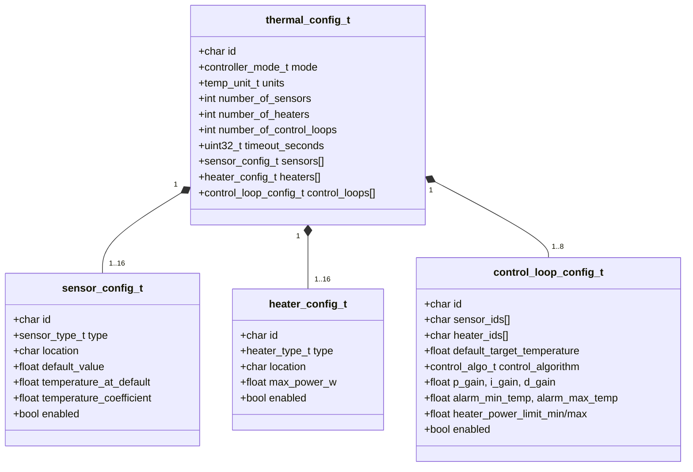
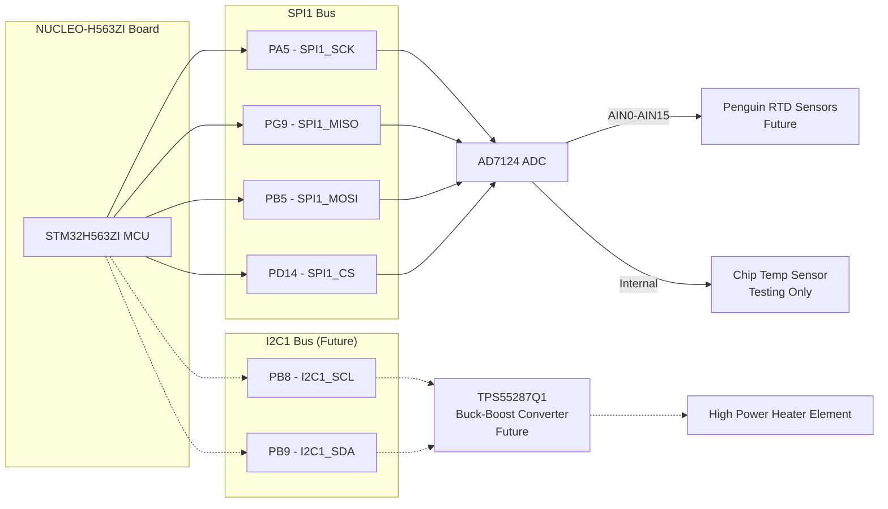

# Thermal Controller Architecture

## System Overview

## Thread Architecture

## File Structure

## Data Flow - Temperature Control

## Configuration Structure

## Hardware Connections

## Key Design Decisions

**Thread Separation**: Sensor reading and control logic in separate threads for better real-time performance
**Thread-Safe Caching**: Mutex-protected sensor and heater state caches for safe cross-thread access
**Modular Design**: Clear separation between config, sensors, heaters, and control logic
**500ms Update Rate**: Both sensor reading and control updates synchronized at 2 Hz
